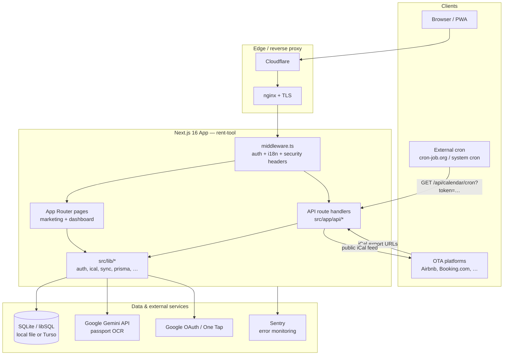
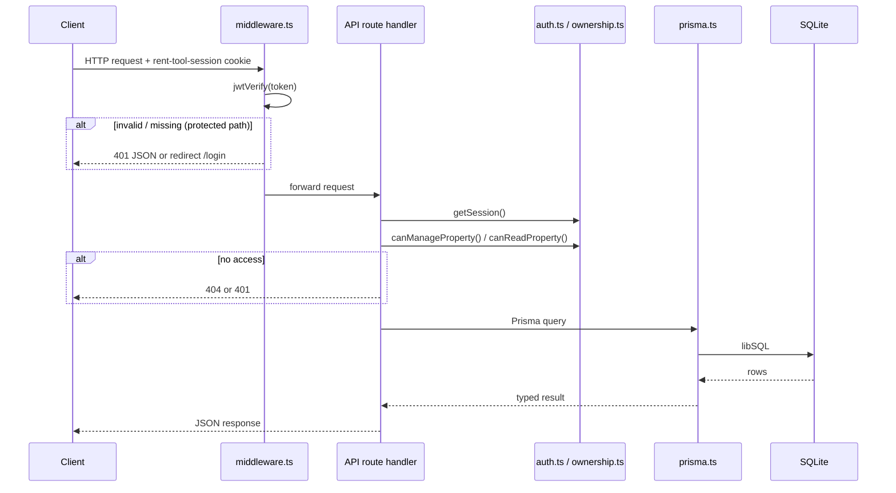

# RentTools Architecture

Developer onboarding guide for the RentTools codebase. Everything here is verified against the repository as of the current `master` branch.

---

## Executive summary

**RentTools** is a free, open-source property manager for short-term rental hosts. Hosts connect platform iCal export URLs (Airbnb, Booking.com, Vrbo, etc.); the app polls them on a schedule, stores events in SQLite, and republishes a combined iCal feed per property so platforms see each other's bookings. On top of calendar sync, the app provides:

- Reservation and guest management (including passport OCR via Google Gemini)
- Cleaning schedules and cleaner assignments
- Multi-property support with owner / manager / cleaner roles
- Pre-arrival guest forms (public share links)
- Message templates, reports, and admin tooling
- A localized marketing site and host-focused blog

The product is a **single Next.js application** — no separate backend service. Pages, API routes, and background sync logic all live in one repo and deploy as one Node process.

---

## High-level architecture



---

## Tech stack

| Layer | Technology |
| --- | --- |
| Framework | Next.js 16 (App Router) |
| UI | React 19, Tailwind CSS 4, Base UI / shadcn-style components |
| Language | TypeScript (strict) |
| Database | SQLite via `@prisma/adapter-libsql` (local `file:` or Turso cloud) |
| ORM | Prisma 7 (client generated to `src/generated/prisma`) |
| Auth | `jose` JWT in HTTP-only cookie (`rent-tool-session`), `bcryptjs` passwords, Google OAuth / One Tap |
| AI | `@google/generative-ai` (Gemini 2.5 Flash for passport extraction) |
| i18n | URL prefixes (`/ru/`, `/de/`, …) + `rt-locale` cookie + `useI18n()` client hook |
| SEO | JSON-LD, dynamic sitemap, `/llms.txt`, per-page SEO overrides in DB |
| Errors | `@sentry/nextjs` (tunnel at `/monitoring`) |
| Tests | Vitest (unit tests colocated with `src/lib/*`) |
| CI | GitHub Actions — build, audit, vitest |
| Hosting | DigitalOcean droplet, systemd, nginx, Cloudflare |

---

## Directory structure

```
src/
  app/              Next.js App Router — pages and API routes
    api/            REST JSON endpoints (~85 route handlers)
    dashboard/      Authenticated app shell + admin sub-routes
    blog/           Public blog (markdown-backed + DB posts)
    g/[token]/      Public pre-arrival guest form
    invite/[token]/ Property manager invite acceptance
    login, signup, onboard, …  Marketing / auth surfaces
  layout.tsx        Root layout — fonts, Providers, session, JSON-LD
  middleware.ts     (lives at src/middleware.ts, not under app/)
  components/       React UI (dashboard panels, calendar, blog, ui/)
  lib/              Shared server/client utilities
    auth.ts         JWT sessions, impersonation, getSession()
    prisma.ts       Prisma client + DB URL resolution
    ical.ts, feed.ts, calendar-sync.ts  iCal parse/generate/sync
    ownership.ts    Property access control (owner/manager/cleaner)
    gemini.ts       Passport OCR integration
    i18n/           Translations, locale detection, alternates
    audit.ts        Mutation audit logging
  generated/prisma/ Prisma client output (postinstall generate)

prisma/
  schema.prisma     Data model
  push-schema.ts    Hand-rolled migrations (LibSQL-compatible ALTERs)
  seed.ts, seed-blog-posts.ts

content/blog/       Markdown blog source (frontmatter-driven)
public/             Static assets, PWA icons, blog covers
scripts/            Deploy, backup, cron wrappers, icon generation
deploy/             nginx config, systemd unit, cron templates
.github/workflows/  ci.yml, deploy.yml
docs/               API.md, DROPLET-SETUP.md, CONTRIBUTING.md, …
```

---

## Application domains

| Domain | Primary locations | Notes |
| --- | --- | --- |
| Calendar sync | `src/lib/calendar-sync.ts`, `src/lib/ical.ts`, `src/lib/feed.ts`, `src/app/api/calendar/*` | Import OTA iCal → `CalendarEvent`; export combined feed |
| Reservations & guests | `src/app/api/reservations/*`, `src/app/api/guests/*`, `src/components/reservation-view.tsx` | Overlap detection, passport guests |
| Passport extraction | `src/app/api/extract/route.ts`, `src/lib/gemini.ts` | Multipart upload → Gemini → `Guest` rows |
| Cleaning | `src/components/cleaning-schedule.tsx`, `src/app/api/cleaning-records/*` | Turnovers, assignments, cleaner role UI |
| Properties & access | `src/lib/ownership.ts`, `src/app/api/property-managers/*` | Owner, manager, cleaner access levels |
| Pre-arrival forms | `src/app/g/[token]`, `src/app/api/g/*`, `GuestFormTemplate` models | Public token-gated forms |
| Onboarding | `src/app/onboard`, `src/app/api/onboard/*`, `OnboardingDraft` | Pre-signup wizard with durable feed slug |
| Blog & SEO | `src/app/blog/*`, `content/blog/`, `src/lib/markdown.ts`, `src/lib/seo.ts` | DB + markdown posts, JSON-LD |
| Admin | `src/app/dashboard/admin/*`, `src/app/api/admin/*` | Superadmin-only operations |
| Auth & accounts | `src/lib/auth.ts`, `src/app/api/auth/*` | Login, signup, Google, email codes, GDPR export/delete |

---

## Key architectural patterns

### Routing

- **App Router** with file-based routes under `src/app/`.
- **Marketing** at `/` (redirects logged-in users to `/dashboard`).
- **Authenticated app** at `/dashboard` — a client-heavy SPA-style shell driven by URL search params (`?property=`, `?view=`, `?reservation=`).
- **Admin** nested under `/dashboard/admin/*` (superadmin UI).
- **Public token routes**: `/g/[token]` (guest forms), `/invite/[token]` (manager invites), `/api/calendar/feed/*` (iCal).

### Middleware (`src/middleware.ts`)

Single entry point for almost all requests:

1. **i18n** — strips locale prefix (`/ru/blog` → internal rewrite to `/blog`) and sets `x-locale` / `x-pathname` headers.
2. **Auth** — verifies `rent-tool-session` JWT; public paths whitelisted; API returns 401 JSON, pages redirect to `/login?next=…`.
3. **Admin API gate** — `/api/admin/*` requires `role === "superadmin"` (with impersonation exit exception).
4. **Security headers** — CSP, `X-Frame-Options`, etc.
5. **Structured HTTP logging** via `src/lib/logger.ts`.

### Data fetching & state

- **No global client data library** (no React Query / Redux). Dashboard components fetch via `fetch("/api/…")` and hold state in React `useState`.
- **Server components** used for marketing/blog layouts and metadata; dashboard is predominantly `"use client"`.
- **Session** resolved once per request on the server (`getSession()` wrapped in React `cache()`), passed to client via `SessionProvider`.
- **URL as state** for dashboard navigation (property, view, reservation in query string).

### API route pattern

Handlers under `src/app/api/<feature>/route.ts` follow conventions documented in `docs/CONTRIBUTING.md`:

- `getSession()` → 401 if missing
- Validate numeric IDs → 400 on bad input
- Property-scoped resources use `src/lib/ownership.ts` — return **404** (not 403) on unauthorized access to avoid leaking existence
- `try/catch` → 500 `{ error: "Internal server error" }`
- Mutations call `logAudit()` from `src/lib/audit.ts`

See `docs/API.md` for endpoint reference.

### Auth model

- JWT (`HS256`, 7-day expiry) in cookie `rent-tool-session`.
- Passwords hashed with bcrypt (cost 10).
- Google sign-in via `src/lib/google-oauth.ts` (+ One Tap).
- Email verification codes for signup/password reset (`EmailCode` model).
- Roles: `user`, `superadmin`, `cleaner`.
- Superadmin **impersonation** — short-lived token with `impersonatorId`; original admin JWT stored in separate cookie.
- Suspended users invalidated on next `getSession()` DB check.

### Property access control

Centralized in `src/lib/ownership.ts`:

| Level | Capabilities |
| --- | --- |
| `owner` | Full control including delete property and manage managers |
| `manager` | Daily ops (calendar, reservations, sync, cleaning) — no delete / manager admin |
| `cleaner` | Read property; write cleaning records for assigned properties |
| `none` | No access |

### Database & migrations

- Prisma schema in `prisma/schema.prisma`; client output at `src/generated/prisma`.
- **Not** using `prisma migrate` for production — schema changes are applied via hand-rolled `ALTER TABLE` in `prisma/push-schema.ts` (LibSQL adapter limitation).
- Run locally: `npm run db:push` → `tsx prisma/push-schema.ts`.
- Connection: `DATABASE_URL=file:./data/prod.db` (self-host) or `TURSO_DATABASE_URL` + `TURSO_AUTH_TOKEN`.

### i18n

- Supported locales: `en`, `ru`, `de`, `fr`, `es` (URL prefix for non-English marketing paths).
- Dashboard uses client-side `useI18n()`; marketing pages use server `getLocale()` from middleware headers.
- Legal pages (`/privacy`, `/terms`) are English-only by design.

---

## Data flow

### Authenticated API request



### Calendar sync (cron / manual)

1. **Trigger**: system cron every 10 min (`scripts/cron-sync.sh` → `GET /api/calendar/cron?token=$CRON_SECRET`) or `POST /api/calendar/sync` (session-scoped).
2. **Fetch**: `calendar-sync.ts` reads `CalendarLink` rows, fetches each `icalExportUrl`.
3. **Parse**: `ical.ts` → `ICalEvent[]`.
4. **Persist**: upsert/delete `CalendarEvent` rows; update link `lastFetchedAt` / `lastError`.
5. **Export**: `feed.ts` merges events, reservations, buffers, and date overrides → iCal served at `/api/calendar/feed/[propertyId]/…`.

### Passport extraction

1. Client `POST /api/extract` (multipart: `files` + `reservationId`).
2. Route calls `getGeminiModel()` (env or `AppSettings` override).
3. Gemini Vision extracts structured fields; `sanitize.ts` cleans output.
4. `Guest` rows created; `ExtractionLog` written for rate limiting / audit.

---

## External integrations

| Service | Purpose | Config |
| --- | --- | --- |
| OTA iCal feeds | Import bookings | Per-property `CalendarLink.icalExportUrl` |
| Google Gemini | Passport OCR | `GOOGLE_GEMINI_API_KEY` or `AppSettings` |
| Google OAuth | Sign-in / One Tap | `NEXT_PUBLIC_GOOGLE_CLIENT_ID`, server secret on droplet |
| Sentry | Error monitoring | `NEXT_PUBLIC_SENTRY_DSN`, build-time source maps |
| Turso (optional) | Cloud SQLite | `TURSO_DATABASE_URL`, `TURSO_AUTH_TOKEN` |
| Email (SMTP) | Verification codes | Configured in env (see `src/lib/email.ts`) |

Public surfaces (no session): iCal feeds, health check, guest form submit, feedback, onboarding draft API, calendar cron.

---

## Build & deployment

### Local development

```bash
npm install          # postinstall: prisma generate; prepare: git hooks
npm run db:push      # apply schema
npm run db:seed      # sample data
npm run dev          # next dev
```

Required env (minimum): `DATABASE_URL`, `JWT_SECRET`, `GEMINI_API_KEY` (for extraction).

### CI (`.github/workflows/ci.yml`)

On every PR/push to `master`:

- Forbidden-path and secret-content scans
- `npm ci`, `npm audit --audit-level=high`
- `npx next build`, `npx vitest run`
- Hermetic: dummy `DATABASE_URL` and `JWT_SECRET` only

### Deploy (`.github/workflows/deploy.yml`)

When `vars.DROPLET_HOST` is set:

1. **Build job** (Node 22): `npm ci` → `prisma generate` → `next build` → tarball `.next/` + `src/generated/prisma`.
2. **Deploy job**: `scp` artifact + `scripts/install-build.sh` to droplet → atomic swap → `systemd` restart.

Docs-only changes under `docs/**` skip deploy (`paths-ignore`) but still run CI.

### Production runtime (`deploy/`)

- **systemd**: `rent-tool.service` — `npm run start` on port 3000, `EnvironmentFile=.env.production`
- **nginx**: reverse proxy + TLS (see `deploy/nginx/rent-tool.conf`)
- **cron**: calendar sync every 10 min, daily DB backup, hourly resource checks (`deploy/cron/rent-tool.cron`)

Full runbook: `docs/DROPLET-SETUP.md`.

### Deploy to Vercel + Turso

Alternative production path for bootstrapped SaaS — no VPS required:

1. Create Turso DB; run `npm run db:push` locally against `TURSO_*` env vars.
2. Import repo to Vercel; set `TURSO_DATABASE_URL`, `TURSO_AUTH_TOKEN`, `JWT_SECRET`, `CRON_SECRET`, `NEXT_PUBLIC_SITE_URL`.
3. Deploy — `postinstall` runs `prisma generate`; `vercel.json` configures cron every 10 min.

Calendar sync and passport extraction use `maxDuration: 60` (requires Vercel Pro for >10s; Hobby caps at 10s).

Full runbook: [docs/VERCEL-TURSO.md](./VERCEL-TURSO.md).

---

## Notable conventions

- **Server components by default**; `"use client"` only when hooks/events needed.
- **Tailwind only** for styling; dark theme palette documented in `docs/CONTRIBUTING.md`.
- **Conventional Commits** (`feat(scope): subject`).
- **Tests** colocated: `foo.ts` → `foo.test.ts`; run with `npm test`.
- **Prisma**: avoid `@updatedAt` directive (LibSQL incompatibility); use nullable `updatedAt` updated in code.
- **Security**: pre-commit hooks + CI scan for secrets; CSP in `next.config.ts` and middleware; property access returns 404 on mismatch.
- **Generated code**: Prisma client in `src/generated/prisma` — do not edit manually.

---

## Related documentation

| Doc | Contents |
| --- | --- |
| [README.md](../README.md) | Product overview, quickstart, FAQ |
| [docs/API.md](./API.md) | REST endpoint reference |
| [docs/CONTRIBUTING.md](./CONTRIBUTING.md) | Code style, API conventions, schema workflow |
| [docs/DROPLET-SETUP.md](./DROPLET-SETUP.md) | Production deployment runbook |
| [docs/VERCEL-TURSO.md](./VERCEL-TURSO.md) | Vercel + Turso deployment runbook |
| [docs/ADDING-A-LANGUAGE.md](./ADDING-A-LANGUAGE.md) | i18n extension guide |
| [docs/SECURITY-AUDIT.md](./SECURITY-AUDIT.md) | Security review notes |
